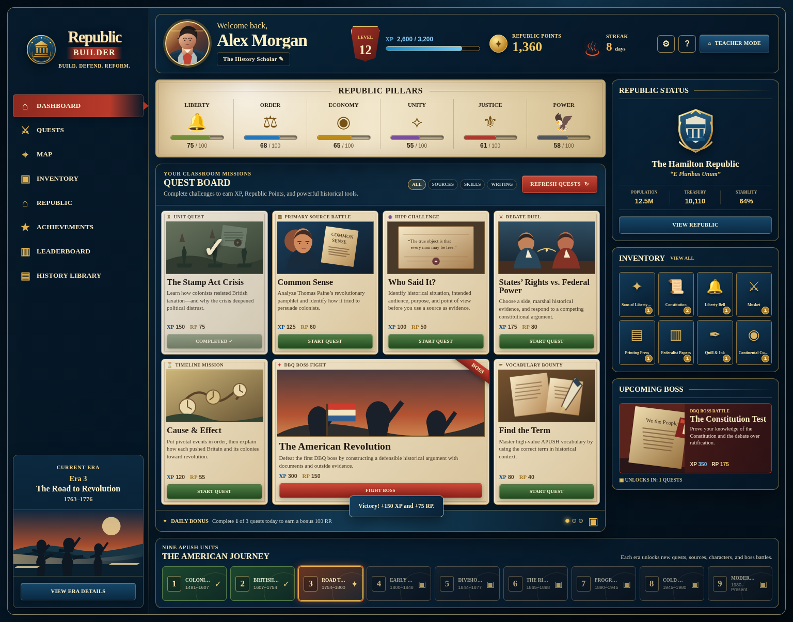

# Republic Builder

A polished **front-end prototype** for an AP U.S. History classroom RPG. Students progress through the nine APUSH units, strengthen their republic, earn historical artifacts, complete quests, and eventually confront writing-based “boss battles.”

This starter is intentionally built with plain HTML, CSS, and JavaScript so that it can run immediately on GitHub Pages—no framework, package manager, database, or build process required.

> **Current scope:** a visual dashboard and interaction prototype. It is not yet a multi-student game, gradebook, secure account system, or full APUSH content bank.



## Open it locally

1. Download or clone this repository.
2. Open `index.html` in a browser.
3. Complete a quest to see XP, Republic Points, pillars, inventory, and daily progress update.
4. Use **Teacher Mode** to test awarding points, unlocking units, or resetting the demo.

The prototype saves progress in that browser’s `localStorage`. Clearing browser site data or using the Teacher Mode reset button restores the starter state.

## Publish with GitHub Pages

1. Create a new GitHub repository named something like `republic-builder`.
2. Upload every file and folder in this starter to the repository root.
3. In the repository, open **Settings → Pages**.
4. Set the deployment source to **Deploy from a branch**, choose `main`, and select the root folder.
5. Save. GitHub Pages will publish the static site after it finishes building.

The included `.nojekyll` file tells GitHub Pages to serve the static files directly.

## Project structure

```text
republic-builder/
├── index.html                 # Main dashboard layout
├── styles.css                 # Responsive game-inspired visual system
├── data.js                    # Starter content: pillars, units, inventory, quests
├── app.js                     # Browser interactions and local demo state
├── assets/                    # Original SVG art used by the interface
├── docs/
│   ├── CONTENT_MODEL.md       # How to add structured quests and game content
│   ├── DESIGN_SYSTEM.md       # Visual language and accessibility guidance
│   ├── ROADMAP.md             # Recommended development sequence
│   └── design-reference.png   # The visual direction provided for this build
├── .gitignore
└── .nojekyll
```

## What the layout already includes

- A desktop-first, responsive game dashboard inspired by a historical strategy RPG.
- A student profile, level shield, XP bar, Republic Points, and streak counter.
- Six adjustable **Republic Pillars**: Liberty, Order, Economy, Unity, Justice, and Power.
- A dynamic quest board for unit quests, primary-source battles, HIPP challenges, debate duels, timeline missions, DBQ boss fights, and vocabulary bounties.
- Short APUSH-style demo questions with answer feedback and rewards.
- A republic status panel, artifact inventory, daily bonus tracker, upcoming boss preview, and full nine-unit APUSH progression rail.
- Local demo-only teacher controls and a profile editor.

## Important implementation notes

- **Do not treat the teacher button as secure.** It is a visual prototype. Any real teacher or student workflow needs authentication, accounts, permissions, and a database.
- **The sample questions are examples, not a complete assessment bank.** Teacher-authored historical content should be reviewed for factual accuracy, wording, accessibility, and alignment to your course sequence.
- The starter uses a Google-hosted font import for the visual style. The site still works with fallback fonts if it is offline.

## Best first changes

1. Update the fictional student and republic names in `app.js`.
2. Change the Unit 3 demo quests in `data.js` to match your actual first unit launch.
3. Add your course colors, school logo, classroom norms, and preferred rewards.
4. Replace the demo teacher controls with a real teacher dashboard only after student logins and cloud data are planned.

See the files in `docs/` before building the next layer.
